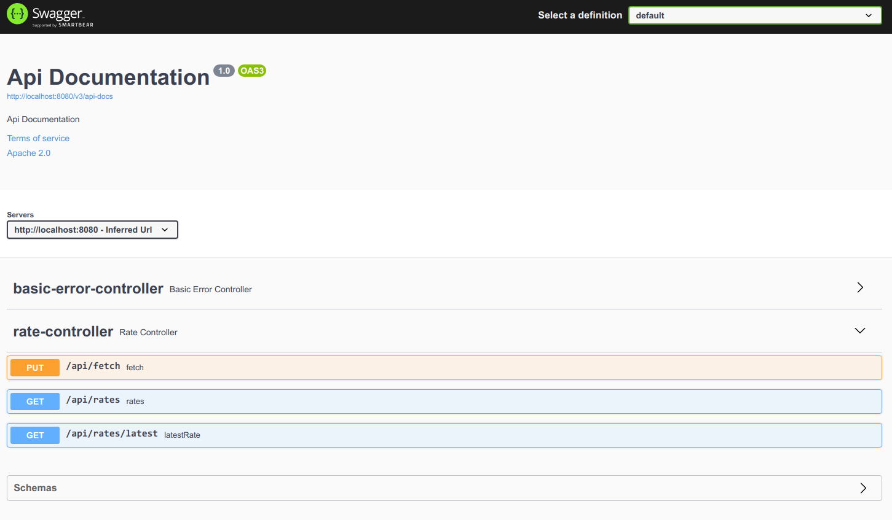

# Searchmetrics coding task

### Tools used

* [Spring initializr](https://start.spring.io/#!type=gradle-project&language=java&platformVersion=2.3.9.RELEASE&packaging=jar&jvmVersion=11&groupId=com.searchmetrics&artifactId=codingtask&name=codingtask&description=Searchmetrics%20coding%20task&packageName=com.searchmetrics.codingtask&dependencies=flapdoodle-mongo,data-mongodb,web)
* Gradle
* MongoDB, for testing [Embedded](https://github.com/flapdoodle-oss/de.flapdoodle.embed.mongo)
* Docker, Docker Compose, [Jib](https://github.com/GoogleContainerTools/jib)
* [Springfox-boot-starter](https://github.com/springfox/springfox)
* Rate source is https://www.blockchain.com/api/exchange_rates_api

### Some notes

* Springfox Swagger UI is can be used for easy access at http://localhost:8080/swagger-ui/, this URL is also echoed to application stdout log
* There are 2 types of tests - Unit and IT (IntegrationTest), for latter spring context is loaded with embedded mongo
* Fetch endpoint is added for convenience
* Rate fetch is Spring CRON expression, can be configured in application.yml
* Scheduler is not multi-instance safe, omitted to not to over-engineer the application, options would be Quartz or ShedLock
* Artifact versions are fixed either directly either with dependency management to produce idempotent builds
* Default run profile is *dev*, default build profile is *prod*

### Running tests

`./gradlew test`

### Build & run

* directly, dev mode:  
  `docker-compose up mongo`  
  `./gradlew`
* build docker image and run:  
  `./gradlew jibDockerBuild`  
  `docker-compose up app`